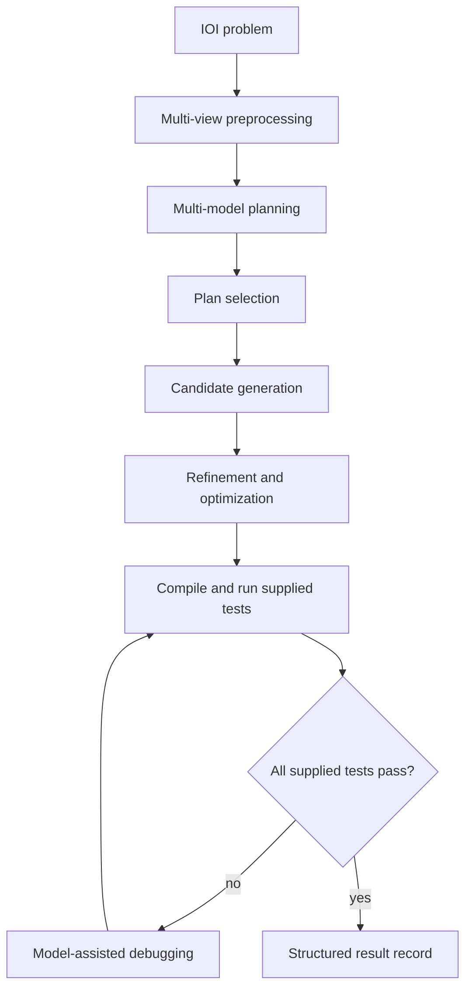

# CTTR-VPS
## Collective Test-Time Reasoning for Verified Program Synthesis
**Status:** research prototype; controlled evaluation pending.

### Research question
Under a fixed benchmark and comparable inference budgets, does structured multi-model planning plus iterative candidate refinement and execution-based verification improve program correctness relative to simpler strategies?

### Hypothesis
**H1 — to be evaluated:** planning diversity, multiple candidates, refinement, and execution checks improve correctness over single-pass generation under comparable compute conditions. This is a hypothesis, not a result.

### Method
- Multi-view problem preprocessing
- Multi-model algorithm planning
- Multiple rounds of C++ candidate generation
- Iterative refinement and optimization
- Compilation, supplied-test execution, and model-assisted debugging

### Architecture


### Baselines
| Method | Status |
|---|---|
| Single-pass generation | Harness scaffold; API-backed run pending |
| Multi-sample generation | Harness scaffold; run pending |
| Self-refinement | Harness scaffold; run pending |
| Execution-based refinement | Integration validation pending |
| CTTR-VPS | Integration validation and benchmark pending |

### Results
**Not yet evaluated.** Historical planning and code artifacts are preserved, but no controlled baseline or ablation results are claimed. Passing visible sample tests does not establish hidden/full-judge acceptance.

### Reproducibility
Python 3.10+, g++ with C++17 support, and API credentials are required.
```bash
python -m venv .venv
source .venv/bin/activate
pip install -r requirements.txt
cp .env.example .env
```
Set GOOGLE_API_KEY and OLLAMA_API_KEY in .env. Never commit credentials. The legacy Ollama client expects an API at http://localhost:11434/api/generate.

```bash
python scripts/run_experiment.py --config configs/baseline_single_pass.yaml
python scripts/run_baselines.py --continue-on-error
python scripts/evaluate.py --results results
```

### Limitations
- Plan selection in the legacy implementation is not calibrated consensus.
- Visible samples do not establish official acceptance.
- Model-call counts may be estimates; token and dollar cost are not fully instrumented.
- The research hypothesis and novelty require controlled evidence.

See docs/architecture.md, docs/experiments.md, docs/result_schema.md, docs/research_positioning.md, and docs/paper.md.

### History
The project originated in the repository previously named Reasoning-Is-All-You-Need. Historical modules and artifacts are retained during migration.